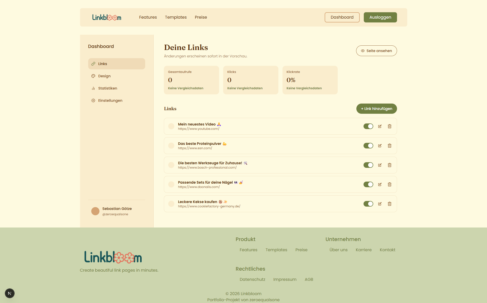
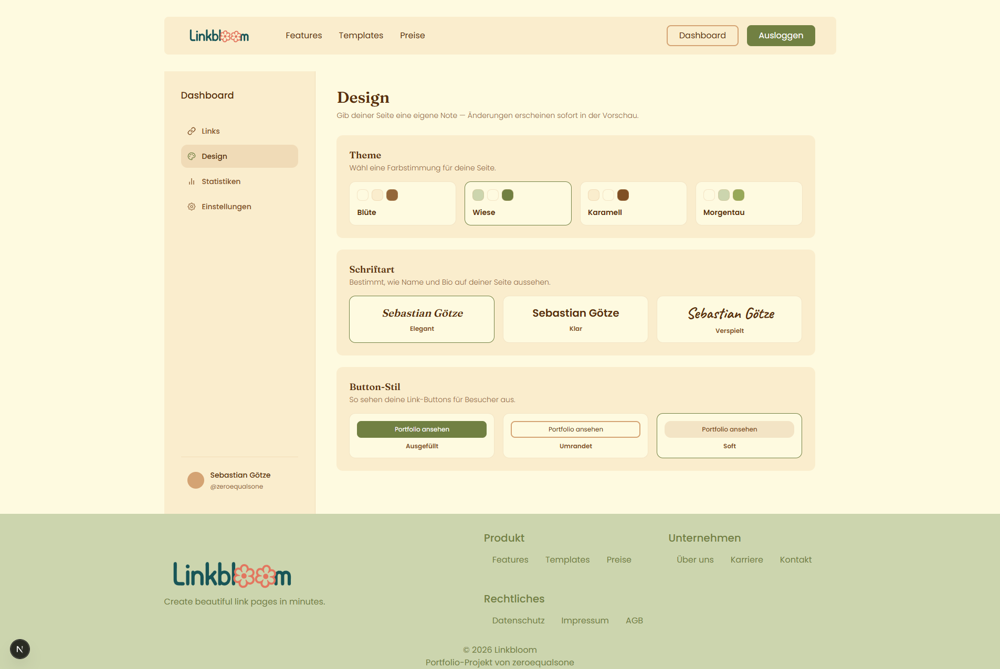
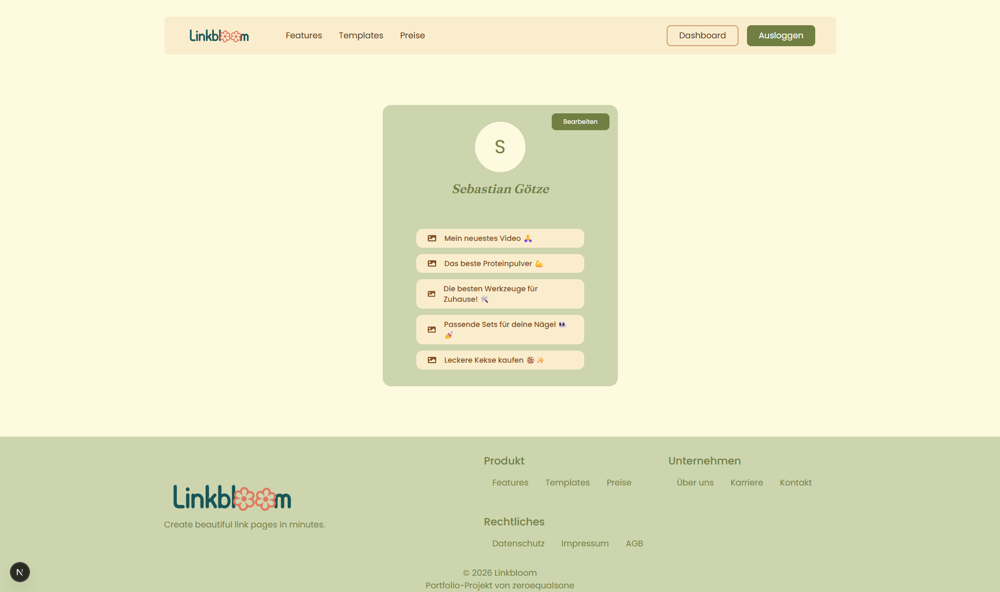

# LinkBloom

> Eine Fullstack Link-in-Bio-Plattform — erstelle eine personalisierte Seite, verwalte deine Links und passe dein Design in Echtzeit an.


🔗 **Live-Demo:** [linkbloom-two.vercel.app](https://linkbloom-two.vercel.app/)
👤 **Beispielprofil:** [/zeroequalsone](https://linkbloom-two.vercel.app/zeroequalsone)

<p align="center">
  
  
  
</p>
<p align="center"><em>Link-Dashboard · Design-Einstellungen · Öffentliches Profil</em></p>

## Über das Projekt

LinkBloom ist eine Link-in-Bio-Plattform (ähnlich Linktree): Nutzer erstellen ein Konto, verwalten ihre Links, passen das Aussehen ihres öffentlichen Profils an und teilen eine URL. Ich habe es gebaut, um über reine Frontend-Arbeit hinauszugehen und echte Erfahrung mit Auth, Datenbankdesign und dem Synchronhalten von Dashboard und öffentlicher Seite zu sammeln — ohne dabei die Komponenten-/UI-Arbeit zu vernachlässigen, die weiterhin mein Schwerpunkt als Frontend-Entwickler ist.

## Features

### Authentifizierung
- Vollständiger Account-Lifecycle via Supabase Auth: Registrieren, Einloggen, Ausloggen
- Nutzername, E-Mail und Passwort im Einstellungs-Dashboard änderbar
- Endgültiges Löschen des Kontos (entfernt Profil, Links und Statistiken)

### Dashboard
- Zentrales Dashboard mit gemeinsamer Sidebar über alle Unteransichten hinweg, die den aktuell aktiven Bereich hervorhebt
- Einstellungsseite für Konto, Benachrichtigungen und Plan

### Link-Verwaltung
- Links erstellen, bearbeiten, löschen und aktivieren/deaktivieren (Toggle)
- Der zuletzt erstellte Link wird zuerst angezeigt, manuelles Umsortieren gibt es noch nicht (siehe Roadmap)
- Das öffentliche Profil zeigt maximal 5 aktive Links

### Design-Anpassung
- Auswahl von Farbthema, Schriftart und Button-Stil für das öffentliche Profil
- Änderungen werden sofort gespeichert und sind beim nächsten Laden des öffentlichen Profils sichtbar — egal ob durch den Besitzer selbst oder durch Besucher
- Hinweis: Aktuell gibt es keine Live-Vorschau *im* Dashboard selbst — das Ergebnis sieht man erst auf der öffentlichen Profilseite. Eine Vorschau im Dashboard steht auf der Roadmap.

### Bearbeiten-Button nur für den Besitzer
- Ist der eingeloggte Besitzer auf seinem eigenen öffentlichen Profil, erscheint ein "Bearbeiten"-Button, der direkt zurück ins Dashboard führt
- Besucher — egal ob ausgeloggt oder als jemand anderes eingeloggt — sehen diesen Button nie

### Analytics *(in Arbeit)*
- Die Berechnungslogik für Aufrufzahlen ist implementiert und korrekt
- Das eigentliche Klick-Tracking ist aktuell in Arbeit. Geplanter Ansatz: Deduplizierung pro Besucher über Browser-Cache/localStorage (in etwa ein gezählter Aufruf pro Profil und Besucher), statt IP-basiertem Tracking, um den Aufwand und die Datenschutz-Abwägungen von IP-Speicherung zu vermeiden

## Roadmap
- [ ] Klick-Tracking für Analytics (siehe oben)
- [ ] Links per Drag & Drop umsortieren
- [ ] Live-Vorschau des Designs direkt im Dashboard

## Tech-Stack
- **Next.js** — App Router, Server- und Client-Komponenten, API-Routen
- **Supabase** — Auth (sowohl Client- als auch Server-seitig) und Postgres-Datenbank
- **Tailwind CSS** — Styling
- **react-icons** — Icon-Set für die UI
- **SVGR** — Import von SVGs als React-Komponenten
- **Vercel** — CI/CD, automatisches Deployment vom `main`-Branch auf GitHub

## Herausforderungen & Was ich gelernt habe
- **Supabase Auth, Client *und* Server-seitig:** Erste Nutzung von Supabase überhaupt. Die meisten Tutorials, die ich gefunden habe, haben nur Client-seitige Auth-Flows behandelt — meine App brauchte aber auch Server-seitige Auth. Das richtig hinzubekommen bedeutete, mich Schritt für Schritt durch die Supabase-Dokumentation zu arbeiten und KI als Lernhilfe zu nutzen, um zu verstehen, *warum* etwas funktioniert, statt einfach nur Code zu kopieren.

## Workflow
- Durchgängig Conventional Commits
- Feature-Branches mit sprechenden Namen, gemerged via Squash & Merge
- Supabase-GitHub-Integration und Vercel-Preview-Builds prüfen bei jedem Branch, ob er baubar ist, bevor gemerged wird

## Lokal ausführen
Die Live-Version wird automatisch von GitHub auf Vercel deployed, das Projekt lässt sich aber auch lokal ausführen:

```bash
git clone https://github.com/zeroequalsone/linkbloom.git
cd linkbloom
npm install
```

Anschließend eine Datei `.env.local` im Projekt-Root anlegen (die benötigten Variablennamen stehen in `.env.local.example`) und dort die eigene Supabase-Projekt-URL sowie den Anon-Key eintragen.

```bash
npm run dev
```

## Über mich
Ich bin Sebastian Götze, Junior Frontend Developer. LinkBloom ist eines von zwei Portfolio-Projekten, die unterschiedliche Seiten meiner Arbeit zeigen: Dieses hier ist Fullstack-fokussiert, während mein anderes Projekt, **Orbit**, stärker datengetrieben ist und auf selbst zusammengestellten Datensätzen aufbaut.

- 🌐 [Mein Portfolio ansehen](https://sgoetze.vercel.app/)
